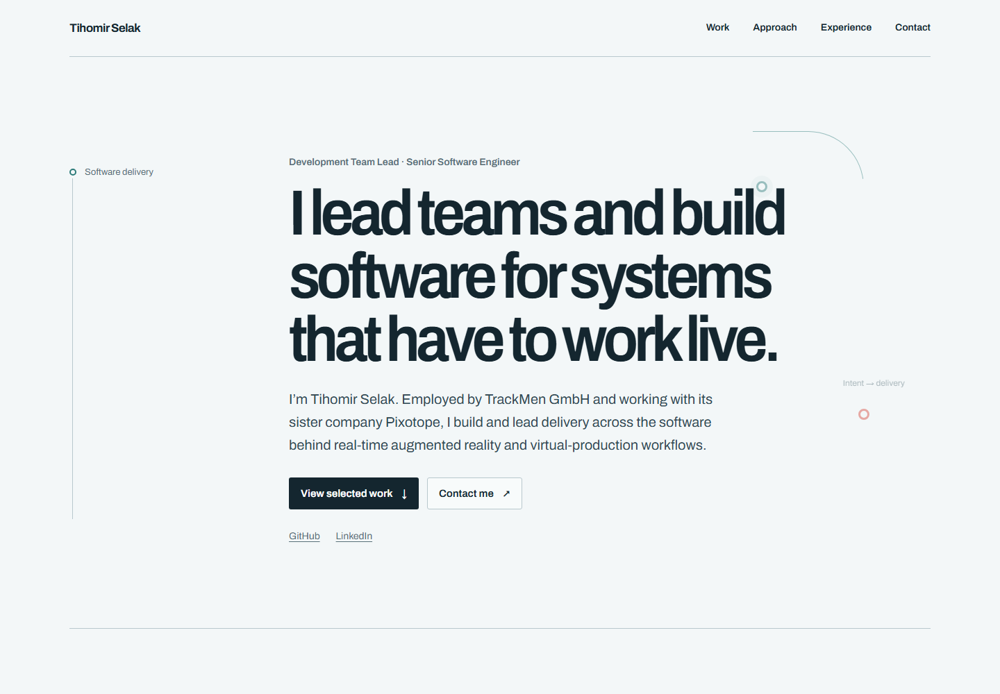
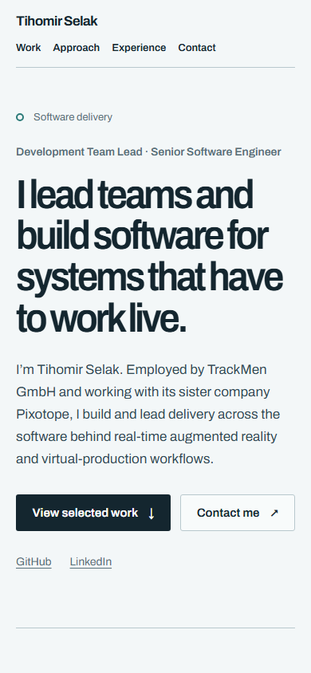

# Tihomir Selak — personal site

A concise professional site for engineering leaders, hiring managers, technical peers, and selected consulting contacts. It presents verified evidence of Tihomir's engineering leadership and software work for real-time augmented reality and virtual production.

The production site is intended for [tihomir-selak.from.hr](https://tihomir-selak.from.hr/). Version one is a static, single-page Astro site with no server runtime, database, CMS, analytics, contact form, or third-party embeds.

## Preview





## Local development

Requires Node.js 24 and Yarn 4.9.2. Enable Corepack, then install and run:

```sh
corepack enable
yarn install --immutable
yarn dev
```

Useful checks:

```sh
yarn format:check
yarn check
yarn build
yarn test:e2e
```

The browser tests run against Astro's production preview and save temporary captures under `.codex/temp/`; the selected review screenshots above are kept with the task record. Install the Playwright Chromium browser with `yarn playwright install chromium` if it is not already available.

## Architecture

- `src/data/` holds the verified site profile, experience, and three evidence-led work stories.
- `src/components/` contains semantic Astro components for navigation, the signal rail, work, approach, timeline, and contact links.
- `src/styles/` defines the cool control-surface palette, responsive editorial grid, accessible focus states, and reduced-motion behavior.
- Astro generates static output in `dist/`, including a sitemap and `404.html`.
- The Astro Fonts API resolves Archivo through Fontsource and serves the chosen font subsets locally; pages have no runtime dependency on Google Fonts or another remote host.

## Content and confidentiality

Public facts are maintained in a private companion workspace. Career facts take precedence over the structured CV, followed by repository evidence for claim boundaries, then profile phrasing. The site repository contains approved public copy only. A public CV download is deferred pending explicit approval to publish the document.

Do not copy private documents, certificates, repository history, local paths, employer screenshots or logos, source code, customer names, internal architecture, or unapproved metrics into the site, metadata, screenshots, or tests. Ask before adding an availability statement, analytics, a form, or third-party embed. Keep the future blog link out until its URL is live.

## Deployment

The site is static and is configured to publish `dist/` with `yarn build`. The GitHub Actions workflow checks and builds pull requests and branch updates. Production deployment runs only on `main` after both `NETLIFY_AUTH_TOKEN` and `NETLIFY_SITE_ID` are present; otherwise it reports that deployment was skipped. Netlify project setup and the custom-domain cutover are deferred.
